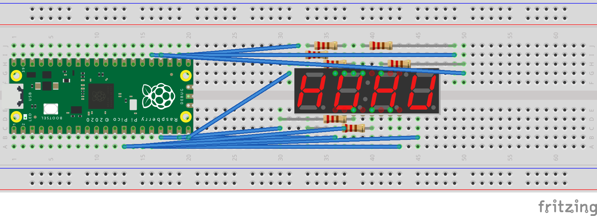
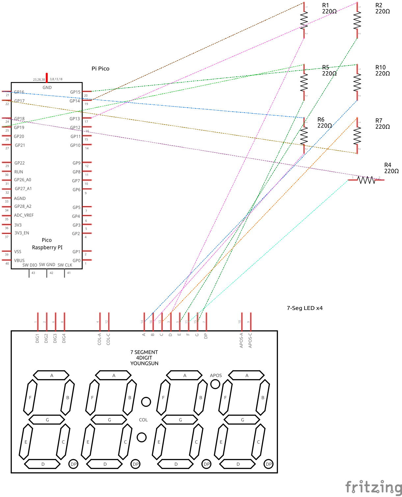
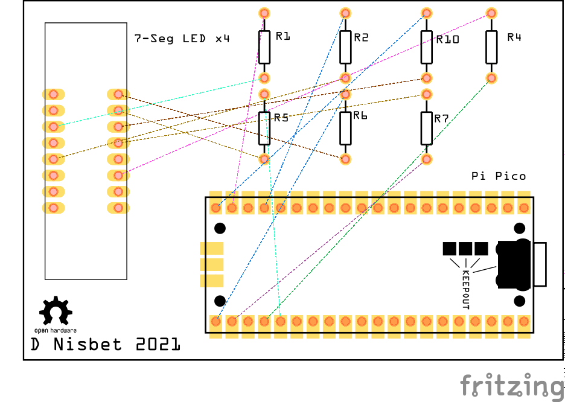

# 7-segment display on a Pi Pico
Breadboard:

thanks to https://raspi.tv/2015/7-segment-display-python-raspberry-pi-countdown-ticker

https://en.wikichip.org/wiki/seven-segment_display/representing_letters

http://docs.micropython.org/en/latest/library/machine.Pin.html

[YS 7-Segment Display Datasheet](https://drive.google.com/file/d/0B3Owa_JtZtR5b2xFQ3NkRU9DRHc/view)
